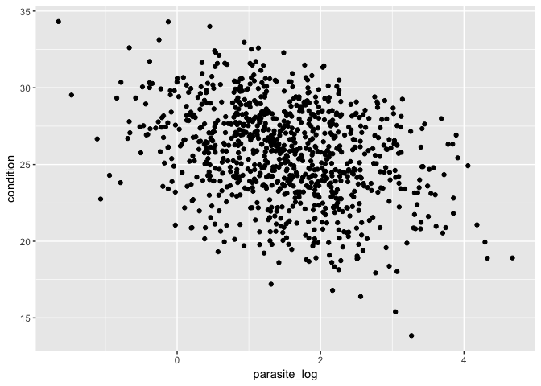
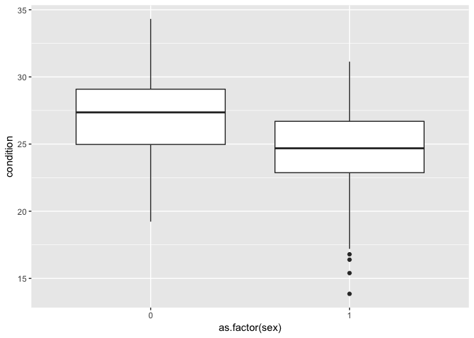
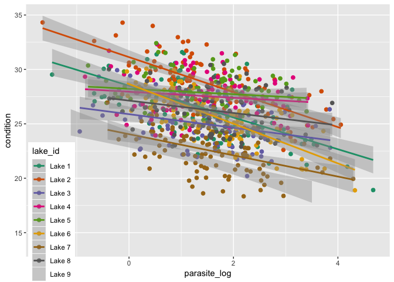
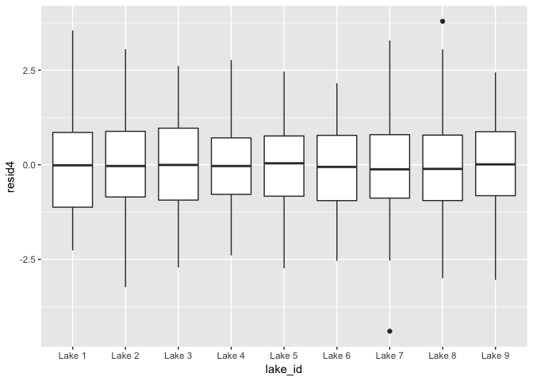
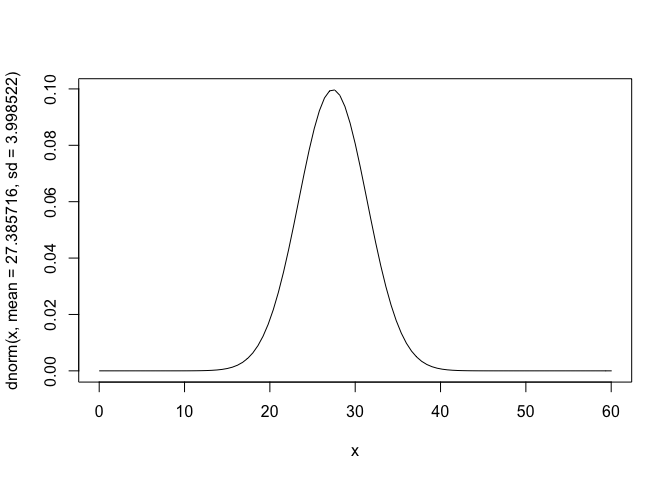
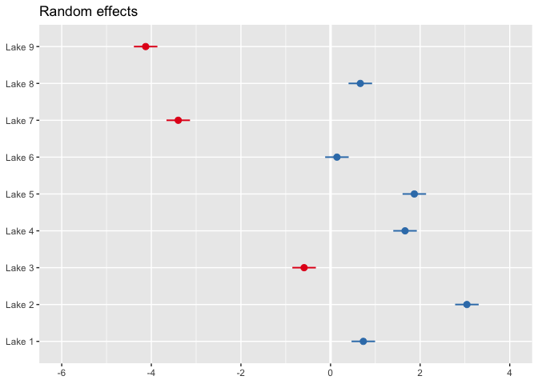
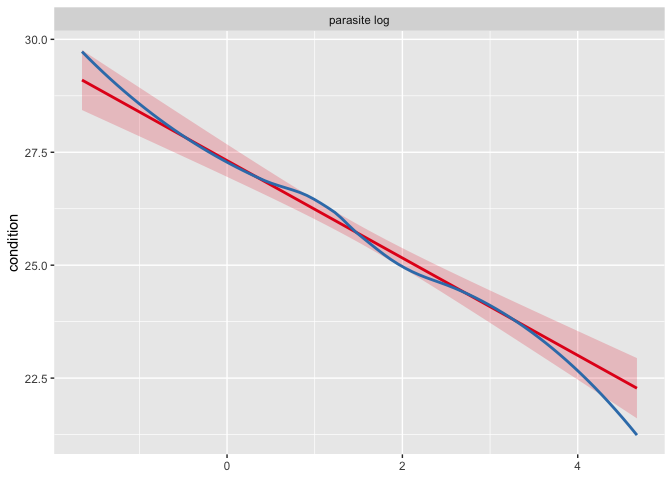
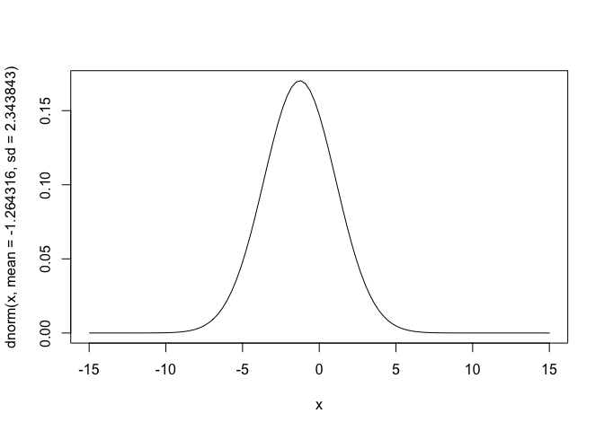

Random Effects
================
Patrick Barks
2017-09-28

### Preliminaries

``` r
# install.packages(c('dplyr', 'tibble', 'ggplot2', 'gridExtra', 'nlme', 'lme4', 'sjPlot'))
library(dplyr)
library(tibble)
library(ggplot2)
library(gridExtra)
library(nlme)
library(lme4)
library(sjPlot)
```

### Generate data with hierarchical structure

``` r
library(dplyr)
library(tibble)

# testing a hypothesis that fish body condition is associated with parasite load
# samples from multiple lakes, incl. male vs. female, of varying age
n_lakes <- 9
n_traps_per_lake <- 10
n_fish_per_trap <- 10
N <- n_lakes * n_traps_per_lake * n_fish_per_trap

sigma_fish <- 1.2
sigma_alpha_lake <- 2.2
sigma_beta_lake <- 0.5
sigma_age <- 2.7
sigma_trap_within_lake <- 1.7

b_int <- 27.2        # intercept
b_sex <- -2.5        # fish sex
b_age <- 0.4         # fish age
b_parasite <- -1.0   # fish parasite load

dat <- expand.grid(lake_id = paste('Lake', 1:n_lakes),
                   trap_id = rep(1:n_traps_per_lake, n_fish_per_trap),
                   stringsAsFactors = F) %>%
  as_tibble() %>%
  mutate(trap_id = paste('T', trap_id, as.numeric(as.factor(lake_id)), sep = '-')) %>%
  arrange(lake_id, trap_id) %>%
  mutate(sex = sample(c(0:1), N, replace = T),
         age = rpois(N, 3),
         parasite = rlnorm(N, 1.5),
         parasite_log = log(parasite))

lake_df <- tibble(lake_id = sort(unique(dat$lake_id)),
                  alpha_lake = rnorm(n_lakes, mean = 0, sd = sigma_alpha_lake),
                  beta_lake = rnorm(n_lakes, mean = 0, sd = sigma_beta_lake))

traps_df <- tibble(trap_id = sort(unique(dat$trap_id)),
                   alpha_trap = rnorm(n_lakes * n_traps_per_lake, mean = 0, sd = sigma_trap_within_lake))

dat <- dat %>%
  left_join(lake_df, by = 'lake_id') %>%
  left_join(traps_df, by = 'trap_id')

X <- as.matrix(cbind(int = 1, dat[,c('sex', 'age', 'parasite_log')]))
dat$condition <- X %*% c(b_int, b_sex, b_age, b_parasite) + dat$alpha_lake + dat$beta_lake * dat$parasite_log + rnorm(N, 0, sigma_fish)
```

### Visualize

``` r
### visualize data
head(dat)
```

    ## # A tibble: 6 x 10
    ##   lake_id trap_id   sex   age parasite parasite_log alpha_lake beta_lake
    ##   <chr>   <chr>   <int> <int>    <dbl>        <dbl>      <dbl>     <dbl>
    ## 1 Lake 1  T-1-1       0     3   20.7          3.03        1.13    -0.306
    ## 2 Lake 1  T-1-1       1     4    0.518       -0.658       1.13    -0.306
    ## 3 Lake 1  T-1-1       0     0    3.82         1.34        1.13    -0.306
    ## 4 Lake 1  T-1-1       0     1    5.09         1.63        1.13    -0.306
    ## 5 Lake 1  T-1-1       0     1   12.8          2.55        1.13    -0.306
    ## 6 Lake 1  T-1-1       1     1    5.27         1.66        1.13    -0.306
    ## # ... with 2 more variables: alpha_trap <dbl>, condition <dbl>

``` r
ggplot(dat, aes(x = parasite_log, y = condition)) +
  geom_point()
```



``` r
# plot(condition ~ parasite_log, dat)

ggplot(dat, aes(x = as.factor(sex), y = condition)) +
  geom_boxplot()
```



``` r
# boxplot(condition ~ sex, dat)

ggplot(dat, aes(x = lake_id, y = condition)) +
  geom_boxplot()
```


``` r
# boxplot(condition ~ lake_id, dat)
```

### Simple linear regression, body condition vs. log parasite load

``` r
# fit model
mod1 <- lm(condition ~ parasite_log, data = dat)

# summarize
summary(mod1)
```

    ## 
    ## Call:
    ## lm(formula = condition ~ parasite_log, data = dat)
    ## 
    ## Residuals:
    ##     Min      1Q  Median      3Q     Max 
    ## -9.9432 -1.9741  0.1272  2.2353  7.1748 
    ## 
    ## Coefficients:
    ##              Estimate Std. Error t value Pr(>|t|)    
    ## (Intercept)   27.3158     0.1831  149.15   <2e-16 ***
    ## parasite_log  -1.0780     0.1025  -10.52   <2e-16 ***
    ## ---
    ## Signif. codes:  0 '***' 0.001 '**' 0.01 '*' 0.05 '.' 0.1 ' ' 1
    ## 
    ## Residual standard error: 2.97 on 898 degrees of freedom
    ## Multiple R-squared:  0.1096, Adjusted R-squared:  0.1086 
    ## F-statistic: 110.6 on 1 and 898 DF,  p-value: < 2.2e-16

``` r
anova(mod1)
```

    ## Analysis of Variance Table
    ## 
    ## Response: condition
    ##               Df Sum Sq Mean Sq F value    Pr(>F)    
    ## parasite_log   1  975.6  975.57  110.56 < 2.2e-16 ***
    ## Residuals    898 7923.6    8.82                      
    ## ---
    ## Signif. codes:  0 '***' 0.001 '**' 0.01 '*' 0.05 '.' 0.1 ' ' 1

``` r
# check residuals
dat$resid1 <- resid(mod1)

ggplot(dat, aes(x = lake_id, y = resid1)) +
  geom_boxplot() +
  geom_hline(yintercept = 0, linetype = 2)
```


``` r
# examine model fit with ggplot
ggplot(dat, aes(x = parasite_log, y = condition)) +
  geom_point(size = 2) +
  geom_smooth(method = 'lm')
```


### Add fixed effect intercepts for lake\_id

``` r
# fit model
mod2 <- lm(condition ~ lake_id + parasite_log, data = dat)

# summarize
summary(mod2)
```

    ## 
    ## Call:
    ## lm(formula = condition ~ lake_id + parasite_log, data = dat)
    ## 
    ## Residuals:
    ##     Min      1Q  Median      3Q     Max 
    ## -5.8199 -1.4659 -0.0363  1.4762  5.0324 
    ## 
    ## Coefficients:
    ##               Estimate Std. Error t value Pr(>|t|)    
    ## (Intercept)   27.85436    0.22657 122.938  < 2e-16 ***
    ## lake_idLake 2  2.42180    0.27993   8.652  < 2e-16 ***
    ## lake_idLake 3 -1.36052    0.28026  -4.854 1.43e-06 ***
    ## lake_idLake 4  1.18389    0.28026   4.224 2.64e-05 ***
    ## lake_idLake 5  1.43624    0.28055   5.119 3.76e-07 ***
    ## lake_idLake 6 -0.46851    0.27992  -1.674   0.0945 .  
    ## lake_idLake 7 -3.67466    0.27991 -13.128  < 2e-16 ***
    ## lake_idLake 8  0.04811    0.27991   0.172   0.8636    
    ## lake_idLake 9 -4.73466    0.28011 -16.903  < 2e-16 ***
    ## parasite_log  -1.05567    0.06873 -15.360  < 2e-16 ***
    ## ---
    ## Signif. codes:  0 '***' 0.001 '**' 0.01 '*' 0.05 '.' 0.1 ' ' 1
    ## 
    ## Residual standard error: 1.979 on 890 degrees of freedom
    ## Multiple R-squared:  0.6082, Adjusted R-squared:  0.6043 
    ## F-statistic: 153.5 on 9 and 890 DF,  p-value: < 2.2e-16

``` r
anova(mod2)
```

    ## Analysis of Variance Table
    ## 
    ## Response: condition
    ##               Df Sum Sq Mean Sq F value    Pr(>F)    
    ## lake_id        8 4488.8  561.10  143.24 < 2.2e-16 ***
    ## parasite_log   1  924.1  924.12  235.92 < 2.2e-16 ***
    ## Residuals    890 3486.3    3.92                      
    ## ---
    ## Signif. codes:  0 '***' 0.001 '**' 0.01 '*' 0.05 '.' 0.1 ' ' 1

``` r
# check residuals
dat$resid2 <- resid(mod2)

# residuals vs. lake
ggplot(dat, aes(x = lake_id, y = resid2)) +
  geom_boxplot() +
  geom_hline(yintercept = 0, linetype = 2)
```


``` r
ggplot(dat, aes(x = age, y = resid2)) +
  geom_point() +
  geom_hline(yintercept = 0, linetype = 2)
```


``` r
# residuals vs. parasite_log within lake
ggplot(dat, aes(x = parasite_log, y = resid2)) +
  geom_point() +
  geom_hline(yintercept = 0, linetype = 2) +
  facet_grid(sex ~ lake_id)
```


### Add fixed effect slopes for lake\_id (with respect to parasite load)

``` r
# fit model
mod3 <- lm(condition ~ parasite_log*lake_id, data = dat)

# summarize
summary(mod3)
```

    ## 
    ## Call:
    ## lm(formula = condition ~ parasite_log * lake_id, data = dat)
    ## 
    ## Residuals:
    ##    Min     1Q Median     3Q    Max 
    ## -5.225 -1.422 -0.101  1.425  5.296 
    ## 
    ## Coefficients:
    ##                            Estimate Std. Error t value Pr(>|t|)    
    ## (Intercept)                 28.5013     0.3393  83.995  < 2e-16 ***
    ## parasite_log                -1.4588     0.1746  -8.354 2.54e-16 ***
    ## lake_idLake 2                2.6299     0.4770   5.513 4.63e-08 ***
    ## lake_idLake 3               -2.6141     0.4768  -5.483 5.46e-08 ***
    ## lake_idLake 4               -0.5523     0.4882  -1.131  0.25831    
    ## lake_idLake 5               -0.2819     0.4834  -0.583  0.55983    
    ## lake_idLake 6                0.1562     0.5122   0.305  0.76039    
    ## lake_idLake 7               -4.4508     0.5161  -8.625  < 2e-16 ***
    ## lake_idLake 8               -1.3677     0.5221  -2.619  0.00896 ** 
    ## lake_idLake 9               -4.9100     0.4848 -10.129  < 2e-16 ***
    ## parasite_log:lake_idLake 2  -0.1490     0.2492  -0.598  0.55002    
    ## parasite_log:lake_idLake 3   0.8375     0.2631   3.184  0.00151 ** 
    ## parasite_log:lake_idLake 4   1.1829     0.2736   4.323 1.72e-05 ***
    ## parasite_log:lake_idLake 5   1.2105     0.2775   4.363 1.44e-05 ***
    ## parasite_log:lake_idLake 6  -0.3641     0.2660  -1.369  0.17132    
    ## parasite_log:lake_idLake 7   0.4851     0.2768   1.753  0.07999 .  
    ## parasite_log:lake_idLake 8   0.8917     0.2816   3.167  0.00159 ** 
    ## parasite_log:lake_idLake 9   0.0768     0.2652   0.290  0.77224    
    ## ---
    ## Signif. codes:  0 '***' 0.001 '**' 0.01 '*' 0.05 '.' 0.1 ' ' 1
    ## 
    ## Residual standard error: 1.914 on 882 degrees of freedom
    ## Multiple R-squared:  0.637,  Adjusted R-squared:   0.63 
    ## F-statistic: 91.05 on 17 and 882 DF,  p-value: < 2.2e-16

``` r
anova(mod3)
```

    ## Analysis of Variance Table
    ## 
    ## Response: condition
    ##                       Df Sum Sq Mean Sq  F value    Pr(>F)    
    ## parasite_log           1  975.6  975.57 266.3736 < 2.2e-16 ***
    ## lake_id                8 4437.3  554.67 151.4477 < 2.2e-16 ***
    ## parasite_log:lake_id   8  256.0   32.00   8.7376 1.546e-11 ***
    ## Residuals            882 3230.3    3.66                       
    ## ---
    ## Signif. codes:  0 '***' 0.001 '**' 0.01 '*' 0.05 '.' 0.1 ' ' 1

``` r
# check residuals
dat$resid3 <- resid(mod3)
ggplot(dat, aes(x = lake_id, y = resid3)) + geom_boxplot()        # resid vs. lake
```


``` r
ggplot(dat, aes(x = as.factor(sex), y = resid3)) + geom_boxplot() # resid vs. sex
```


``` r
ggplot(dat, aes(x = age, y = resid3)) + geom_point()              # resid vs. age
```


``` r
# examine model fit with ggplot
ggplot(dat, aes(x = parasite_log, y = condition, col = lake_id)) +
  geom_point(size = 2) +
  geom_smooth(method = 'lm') +
  scale_color_brewer(palette = 'Dark2') +
  theme(legend.position = c(0.07, 0.17))
```



### Add in terms for fish age and sex

``` r
# fit model
mod4 <- lm(condition ~ age + sex + parasite_log*lake_id, data = dat)

# summarize
summary(mod4)$coefficients
```

    ##                               Estimate Std. Error      t value
    ## (Intercept)                29.08549569 0.23491891 123.81079053
    ## age                         0.35169926 0.02366780  14.85982114
    ## sex                        -2.63141293 0.08452267 -31.13262999
    ## parasite_log               -1.50397513 0.11429323 -13.15891654
    ## lake_idLake 2               2.43391442 0.31227141   7.79422761
    ## lake_idLake 3              -2.73843489 0.31206287  -8.77526670
    ## lake_idLake 4              -0.86621194 0.31972188  -2.70926701
    ## lake_idLake 5              -0.02198205 0.31689090  -0.06936789
    ## lake_idLake 6              -0.13934442 0.33553811  -0.41528642
    ## lake_idLake 7              -4.95436719 0.33805969 -14.65530307
    ## lake_idLake 8              -1.40565778 0.34179139  -4.11261905
    ## lake_idLake 9              -4.88352552 0.31725816 -15.39290758
    ## parasite_log:lake_idLake 2 -0.08760126 0.16314712  -0.53694641
    ## parasite_log:lake_idLake 3  0.95358571 0.17219335   5.53787759
    ## parasite_log:lake_idLake 4  1.23239957 0.17908987   6.88145891
    ## parasite_log:lake_idLake 5  0.79720882 0.18205064   4.37904974
    ## parasite_log:lake_idLake 6 -0.25971253 0.17409799  -1.49176062
    ## parasite_log:lake_idLake 7  0.50875365 0.18114641   2.80852184
    ## parasite_log:lake_idLake 8  0.84330582 0.18463090   4.56752260
    ## parasite_log:lake_idLake 9 -0.03532888 0.17367142  -0.20342368
    ##                                 Pr(>|t|)
    ## (Intercept)                 0.000000e+00
    ## age                         9.878001e-45
    ## sex                        4.620364e-144
    ## parasite_log                3.122645e-36
    ## lake_idLake 2               1.825563e-14
    ## lake_idLake 3               8.737357e-18
    ## lake_idLake 4               6.874251e-03
    ## lake_idLake 5               9.447125e-01
    ## lake_idLake 6               6.780335e-01
    ## lake_idLake 7               1.122467e-43
    ## lake_idLake 8               4.278528e-05
    ## lake_idLake 9               1.597460e-47
    ## parasite_log:lake_idLake 2  5.914404e-01
    ## parasite_log:lake_idLake 3  4.042991e-08
    ## parasite_log:lake_idLake 4  1.124709e-11
    ## parasite_log:lake_idLake 5  1.335316e-05
    ## parasite_log:lake_idLake 6  1.361203e-01
    ## parasite_log:lake_idLake 7  5.087142e-03
    ## parasite_log:lake_idLake 8  5.638597e-06
    ## parasite_log:lake_idLake 9  8.388509e-01

``` r
anova(mod4)
```

    ## Analysis of Variance Table
    ## 
    ## Response: condition
    ##                       Df Sum Sq Mean Sq F value    Pr(>F)    
    ## age                    1  303.3  303.29 193.343 < 2.2e-16 ***
    ## sex                    1 1347.6 1347.62 859.096 < 2.2e-16 ***
    ## parasite_log           1 1082.7 1082.70 690.207 < 2.2e-16 ***
    ## lake_id                8 4567.3  570.91 363.948 < 2.2e-16 ***
    ## parasite_log:lake_id   8  217.9   27.24  17.362 < 2.2e-16 ***
    ## Residuals            880 1380.4    1.57                      
    ## ---
    ## Signif. codes:  0 '***' 0.001 '**' 0.01 '*' 0.05 '.' 0.1 ' ' 1

``` r
# check residuals
dat$resid4 <- resid(mod4)
ggplot(dat, aes(lake_id, resid4)) + geom_boxplot()  # resid vs. lake
```



``` r
ggplot(dat, aes(sex, resid4)) + geom_boxplot()      # resid vs. sex
```


``` r
ggplot(dat, aes(age, resid4)) + geom_point()        # resid vs. age
```


### Model as above, but with random intercepts for lake\_id (i.e. mixed effect model)

``` r
# fit model
mod5a <- lme(condition ~ age + sex + parasite_log, random = ~ 1 | lake_id, data = dat)
mod5b <- lmer(condition ~ age + sex + parasite_log + (1 | lake_id), data = dat)

# summarize nlme
summary(mod5a)
```

    ## Linear mixed-effects model fit by REML
    ##  Data: dat 
    ##        AIC      BIC    logLik
    ##   3154.298 3183.086 -1571.149
    ## 
    ## Random effects:
    ##  Formula: ~1 | lake_id
    ##         (Intercept) Residual
    ## StdDev:    2.387482 1.341599
    ## 
    ## Fixed effects: condition ~ age + sex + parasite_log 
    ##                  Value Std.Error  DF   t-value p-value
    ## (Intercept)  27.733689 0.8046074 888  34.46860       0
    ## age           0.353410 0.0252544 888  13.99401       0
    ## sex          -2.645828 0.0900647 888 -29.37696       0
    ## parasite_log -1.116768 0.0466899 888 -23.91884       0
    ##  Correlation: 
    ##              (Intr) age    sex   
    ## age          -0.086              
    ## sex          -0.059 -0.013       
    ## parasite_log -0.082 -0.064  0.015
    ## 
    ## Standardized Within-Group Residuals:
    ##         Min          Q1         Med          Q3         Max 
    ## -3.32273951 -0.66779687 -0.01761428  0.64068961  3.14031227 
    ## 
    ## Number of Observations: 900
    ## Number of Groups: 9

``` r
anova(mod5a)
```

    ##              numDF denDF   F-value p-value
    ## (Intercept)      1   888 1039.2392  <.0001
    ## age              1   888  147.4645  <.0001
    ## sex              1   888  842.6433  <.0001
    ## parasite_log     1   888  572.1111  <.0001

``` r
# summarize lme4 (see: help('pvalues', package = 'lme4'))
summary(mod5b)
```

    ## Linear mixed model fit by REML ['lmerMod']
    ## Formula: condition ~ age + sex + parasite_log + (1 | lake_id)
    ##    Data: dat
    ## 
    ## REML criterion at convergence: 3142.3
    ## 
    ## Scaled residuals: 
    ##     Min      1Q  Median      3Q     Max 
    ## -3.3227 -0.6678 -0.0176  0.6407  3.1403 
    ## 
    ## Random effects:
    ##  Groups   Name        Variance Std.Dev.
    ##  lake_id  (Intercept) 5.7      2.387   
    ##  Residual             1.8      1.342   
    ## Number of obs: 900, groups:  lake_id, 9
    ## 
    ## Fixed effects:
    ##              Estimate Std. Error t value
    ## (Intercept)  27.73369    0.80461   34.47
    ## age           0.35341    0.02525   13.99
    ## sex          -2.64583    0.09006  -29.38
    ## parasite_log -1.11677    0.04669  -23.92
    ## 
    ## Correlation of Fixed Effects:
    ##             (Intr) age    sex   
    ## age         -0.086              
    ## sex         -0.059 -0.013       
    ## parasite_lg -0.082 -0.064  0.015

``` r
anova(mod5b)
```

    ## Analysis of Variance Table
    ##              Df  Sum Sq Mean Sq F value
    ## age           1  265.42  265.42  147.46
    ## sex           1 1516.66 1516.66  842.64
    ## parasite_log  1 1029.74 1029.74  572.11

``` r
drop1(mod5b, test = 'Chisq')
```

    ## Single term deletions
    ## 
    ## Model:
    ## condition ~ age + sex + parasite_log + (1 | lake_id)
    ##              Df    AIC    LRT   Pr(Chi)    
    ## <none>          3142.8                     
    ## age           1 3318.4 177.59 < 2.2e-16 ***
    ## sex           1 3745.6 604.77 < 2.2e-16 ***
    ## parasite_log  1 3584.0 443.14 < 2.2e-16 ***
    ## ---
    ## Signif. codes:  0 '***' 0.001 '**' 0.01 '*' 0.05 '.' 0.1 ' ' 1

``` r
# check random effects
ranef(mod5a)
```

    ##        (Intercept)
    ## Lake 1   0.7315375
    ## Lake 2   3.0437467
    ## Lake 3  -0.5899330
    ## Lake 4   1.6631965
    ## Lake 5   1.8699227
    ## Lake 6   0.1426036
    ## Lake 7  -3.3993843
    ## Lake 8   0.6647996
    ## Lake 9  -4.1264894

``` r
# examine distribution describing of random intercepts
curve(dnorm(x, mean = 27.385716, sd = 3.998522), from = 0, to = 60)
```



``` r
# plot effects
plot_model(mod5b, type = 're', vars = 'parasite_log')
```



``` r
plot_model(mod5b, type = 'slope', terms = 'parasite_log', show.ci = T, point.alpha = 1)
```



### Random intercepts and slopes for lake\_id

``` r
# fit model
mod6a <- lme(condition ~ age + sex + parasite_log, random = ~ parasite_log | lake_id, data = dat)
mod6b <- lmer(condition ~ age + sex + parasite_log + (parasite_log | lake_id), data = dat)

# summarize nlme
summary(mod6a)
```

    ## Linear mixed-effects model fit by REML
    ##  Data: dat 
    ##        AIC      BIC    logLik
    ##   3058.889 3097.272 -1521.444
    ## 
    ## Random effects:
    ##  Formula: ~parasite_log | lake_id
    ##  Structure: General positive-definite, Log-Cholesky parametrization
    ##              StdDev    Corr  
    ## (Intercept)  2.4142008 (Intr)
    ## parasite_log 0.5289306 -0.168
    ## Residual     1.2524544       
    ## 
    ## Fixed effects: condition ~ age + sex + parasite_log 
    ##                  Value Std.Error  DF   t-value p-value
    ## (Intercept)  27.690575 0.8123834 888  34.08560       0
    ## age           0.351876 0.0236614 888  14.87127       0
    ## sex          -2.631795 0.0844924 888 -31.14831       0
    ## parasite_log -1.067915 0.1817446 888  -5.87591       0
    ##  Correlation: 
    ##              (Intr) age    sex   
    ## age          -0.080              
    ## sex          -0.055 -0.012       
    ## parasite_log -0.180 -0.016  0.005
    ## 
    ## Standardized Within-Group Residuals:
    ##          Min           Q1          Med           Q3          Max 
    ## -3.523732055 -0.714228066 -0.007502019  0.657067166  3.048621519 
    ## 
    ## Number of Observations: 900
    ## Number of Groups: 9

``` r
anova(mod6a)
```

    ##              numDF denDF   F-value p-value
    ## (Intercept)      1   888 1105.1750  <.0001
    ## age              1   888  207.6508  <.0001
    ## sex              1   888  968.5442  <.0001
    ## parasite_log     1   888   34.5264  <.0001

``` r
# check random effects
ranef(mod6a)
```

    ##        (Intercept) parasite_log
    ## Lake 1  1.35752721  -0.41471178
    ## Lake 2  3.77239883  -0.49347192
    ## Lake 3 -1.29855134   0.48698201
    ## Lake 4  0.59270276   0.74797095
    ## Lake 5  1.39589252   0.34011098
    ## Lake 6  1.18352999  -0.65364106
    ## Lake 7 -3.52814557   0.05873174
    ## Lake 8  0.03128926   0.37976365
    ## Lake 9 -3.50664366  -0.45173457

``` r
# examine distributions describing random intercepts and slopes
curve(dnorm(x, mean = 26.512292, sd = 2.912040), from = 0, to = 60)   # random intercepts
```


``` r
curve(dnorm(x, mean = -1.264316, sd = 2.343843), from = -15, to = 15) # random slopes
```



``` r
# plot effects
plot_model(mod6b, type = 're')
```


``` r
plot_model(mod6b, type = 'slope', terms = 'parasite_log')
```


``` r
# confidence intervals
confint(mod6b, parm = '(Intercept)')
```

    ##                2.5 %   97.5 %
    ## (Intercept) 26.01615 29.36521

``` r
confint(mod6b, parm = 'parasite_log')
```

    ##                 2.5 %     97.5 %
    ## parasite_log -1.44221 -0.6921612
