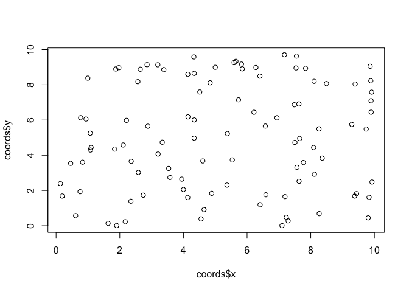

Nifty but forgettable functions
================
Brian
2018-10-01

Sampling functions
------------------

Can be used for planning experiments (e.g. particularly useful in choosing plots & tank numbers).

``` r
X <- 1:6
sample(X)
```

    ## [1] 6 1 5 3 2 4

``` r
sample(X,1)
```

    ## [1] 1

``` r
# five random numbers between 0 and 1
runif(n=5,min=0,max=1)
```

    ## [1] 0.52554565 0.73387851 0.08312503 0.67951857 0.67761105

``` r
# e.g. generate random points on the cartesian plane
# useful for generating preliminary datasets (i.e. simulate measurements)
coords <- data.frame(x=runif(100,0,10),y=runif(100,0,10))
plot(coords$x, coords$y)
```



Repeat function
---------------

Useful for generating and annotating dataframes.

``` r
E <- rep(c("M","F"),each = 3)
E
```

    ## [1] "M" "M" "M" "F" "F" "F"

``` r
G <- rep(c("M","F"),c(2,4))
G
```

    ## [1] "M" "M" "F" "F" "F" "F"

Loops
-----

``` r
money <- 100
for (i in 1:50){
  if(sample(1:6,1)%in%1:3){money = money + 10 }else{ money <- money -10}
}
money
```

    ## [1] 40

``` r
# basic for-loop without subsitutions designated just runs the function for the designated number
for (i in 1:3) {print('hi')}
```

    ## [1] "hi"
    ## [1] "hi"
    ## [1] "hi"

``` r
for (i in 1:2) {print('hi')}
```

    ## [1] "hi"
    ## [1] "hi"
