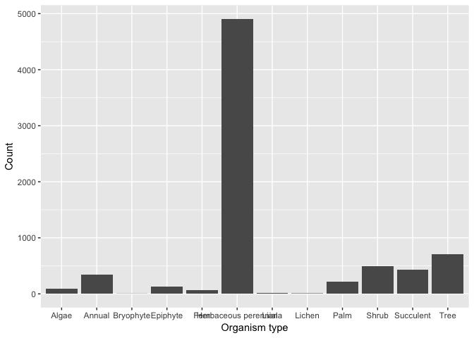
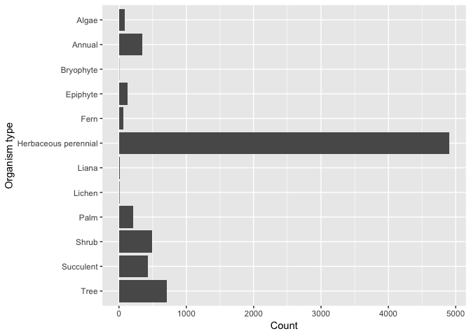
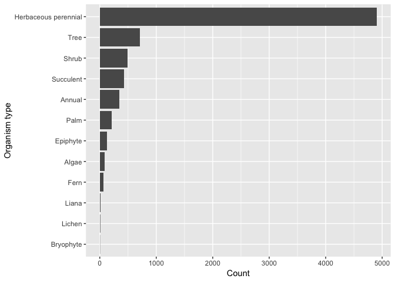
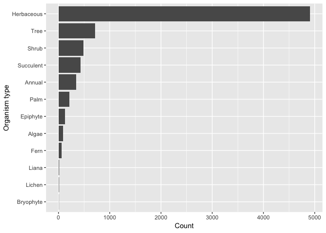
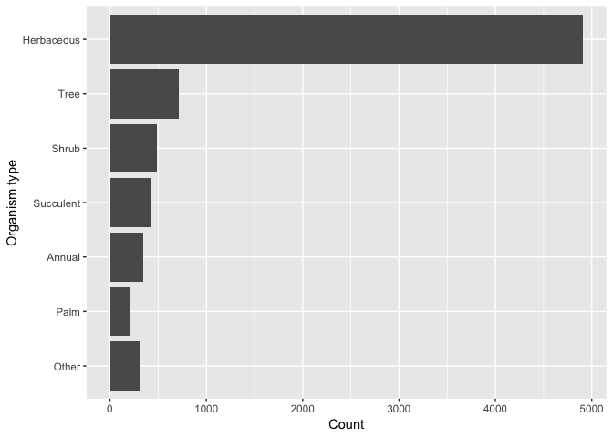

forcats
================
Patrick Barks
2019-01-15

[forcats](https://forcats.tidyverse.org/) is a [tidyverse](https://www.tidyverse.org/) package for working with categorical variables (i.e. factors). Sadly, it is has nothing to do with cats.


### Preliminaries

``` r
library(ggplot2)
library(forcats)
```

### Load data

``` r
compadre <- read.csv("data/compadre_meta.csv", stringsAsFactors = F)
compadre[1:5, 1:10]
```

    ##         SpeciesAuthor     SpeciesAccepted CommonName       Genus
    ## 1         Alaria_nana         Alaria nana       <NA>      Alaria
    ## 2         Alaria_nana         Alaria nana       <NA>      Alaria
    ## 3         Alaria_nana         Alaria nana       <NA>      Alaria
    ## 4 Ascophyllum_nodosum Ascophyllum nodosum       <NA> Ascophyllum
    ## 5 Ascophyllum_nodosum Ascophyllum nodosum       <NA> Ascophyllum
    ##       Family        Order        Class           Phylum        Kingdom
    ## 1 Alariaceae Laminariales Phaeophyceae       Ochrophyta Chromalveolata
    ## 2 Alariaceae Laminariales Phaeophyceae       Ochrophyta Chromalveolata
    ## 3 Alariaceae Laminariales Phaeophyceae       Ochrophyta Chromalveolata
    ## 4   Fucaceae      Fucales Phaeophyceae Heterokontophyta Chromalveolata
    ## 5   Fucaceae      Fucales Phaeophyceae Heterokontophyta Chromalveolata
    ##   OrganismType
    ## 1        Algae
    ## 2        Algae
    ## 3        Algae
    ## 4        Algae
    ## 5        Algae

### Counts by OrganismType

``` r
table(compadre$OrganismType)
```

    ## 
    ##                Algae               Annual            Bryophyte 
    ##                   87                  345                    3 
    ##             Epiphyte                 Fern Herbaceous perennial 
    ##                  128                   64                 4906 
    ##                Liana               Lichen                 Palm 
    ##                   14                    7                  215 
    ##                Shrub            Succulent                 Tree 
    ##                  488                  429                  711

``` r
fct_count(compadre$OrganismType)
```

    ## # A tibble: 12 x 2
    ##    f                        n
    ##    <fct>                <int>
    ##  1 Algae                   87
    ##  2 Annual                 345
    ##  3 Bryophyte                3
    ##  4 Epiphyte               128
    ##  5 Fern                    64
    ##  6 Herbaceous perennial  4906
    ##  7 Liana                   14
    ##  8 Lichen                   7
    ##  9 Palm                   215
    ## 10 Shrub                  488
    ## 11 Succulent              429
    ## 12 Tree                   711

### Plot OrganismType counts with default factor levels

``` r
ggplot(compadre, aes(x = OrganismType)) +
  geom_bar() +
  labs(x = "Organism type", y = "Count")
```



### Flip it and reverse it (fct\_rev)

``` r
ggplot(compadre, aes(x = fct_rev(OrganismType))) +
  geom_bar() +
  coord_flip() +
  labs(x = "Organism type", y = "Count")
```



### Re-order factor levels by frequency (fct\_infreq)

``` r
compadre$OrganismType <- fct_infreq(compadre$OrganismType)

ggplot(compadre, aes(fct_rev(OrganismType))) +
  geom_bar() +
  coord_flip() +
  labs(x = "Organism type", y = "Count")
```



### Re-label one of the factor levels (fct\_recode)

``` r
compadre$OrganismType <- fct_recode(compadre$OrganismType,
                                    "Herbaceous" = "Herbaceous perennial")

ggplot(compadre, aes(fct_rev(OrganismType))) +
  geom_bar() +
  coord_flip() +
  labs(x = "Organism type", y = "Count")
```



### Lump uncommon factor levels into 'Other' category (fct\_lump)

``` r
ggplot(compadre, aes(fct_rev(fct_lump(OrganismType, n = 6)))) +
  geom_bar() +
  coord_flip() +
  labs(x = "Organism type", y = "Count")
```


