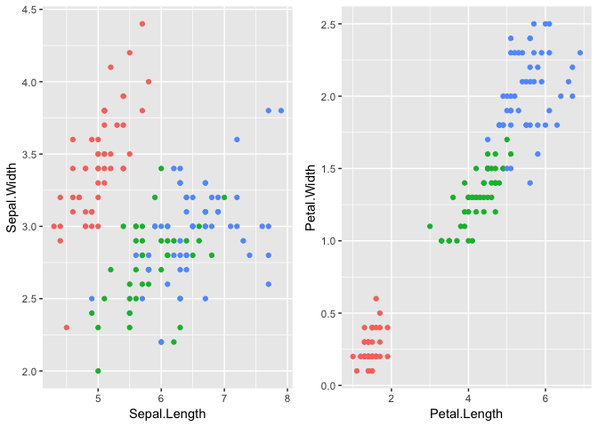
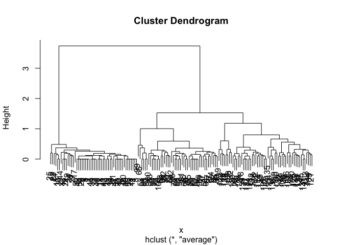
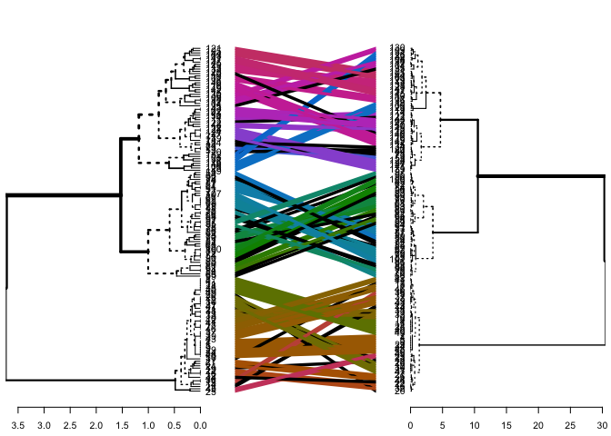

Cluster Analysis
================
Owen Jones
2018-12-01

Cluster Analysis
----------------

Cluster Analysis is a statistical tool for identifying structure in data and identifying groups based on similarity. It is used in various fields and has become known as a central tool in unsupervised machine learning. There are numerous algorithms and this worksheet focuses on a couple of use cases.

The main function we will use is the `hclust` function from the `stats` package. This package ships with base R, so you should have it available.

``` r
data(iris)
summary(iris)
```

    ##   Sepal.Length    Sepal.Width     Petal.Length    Petal.Width   
    ##  Min.   :4.300   Min.   :2.000   Min.   :1.000   Min.   :0.100  
    ##  1st Qu.:5.100   1st Qu.:2.800   1st Qu.:1.600   1st Qu.:0.300  
    ##  Median :5.800   Median :3.000   Median :4.350   Median :1.300  
    ##  Mean   :5.843   Mean   :3.057   Mean   :3.758   Mean   :1.199  
    ##  3rd Qu.:6.400   3rd Qu.:3.300   3rd Qu.:5.100   3rd Qu.:1.800  
    ##  Max.   :7.900   Max.   :4.400   Max.   :6.900   Max.   :2.500  
    ##        Species  
    ##  setosa    :50  
    ##  versicolor:50  
    ##  virginica :50  
    ##                 
    ##                 
    ## 

Clustering using the iris dataset
---------------------------------

The idea here is that we are experimenting with the clustering algorithm using data where we **do** know something about the structure. In this case, we know what the species are. Will cluster analysis find this structure? Let's plot stuff.



You can see that there are some clustering here. Let's quantify it by first calculating a distance matrix (`dist`) and then using `hclust` to perform a hierarchical cluster analysis. You can then plot the result with `plot`.

``` r
names(iris)
```

    ## [1] "Sepal.Length" "Sepal.Width"  "Petal.Length" "Petal.Width" 
    ## [5] "Species"

``` r
x <- iris[,3:4]
x <- dist(x)
clustResult <- hclust(x,method="average")
#clustResult <- cluster::agnes(x, stand=FALSE,method = "ward")

plot(clustResult)
```



Let's cut the tree where we find 3 clusters. You can do this with the `cutree` function.

``` r
iris$clusterID <- cutree(clustResult, 3)
```

Then we can see how well our cluster analysis has recovered the actual species.

``` r
table(iris$clusterID,iris$Species)
```

    ##    
    ##     setosa versicolor virginica
    ##   1     50          0         0
    ##   2      0         45         1
    ##   3      0          5        49

Try repeating this with the rest of the data (sepals), and with other algorithms (e.g. `method = "complete"`)

Comparing...
------------

``` r
clustResult2 <- hclust(x,method="ward.D2")
```

``` r
dendextend::tanglegram(as.dendrogram(clustResult),as.dendrogram(clustResult2))
```


