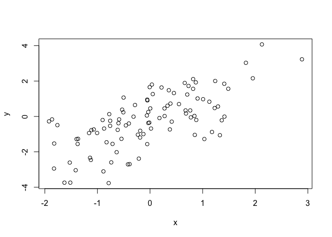
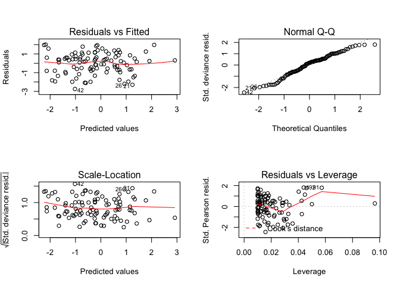
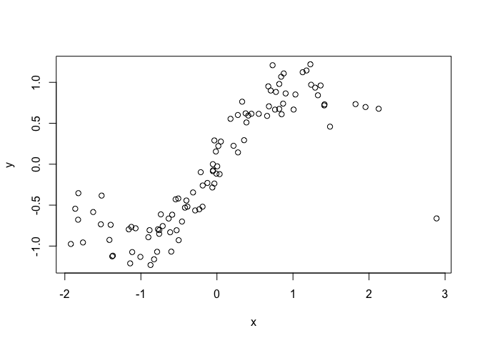
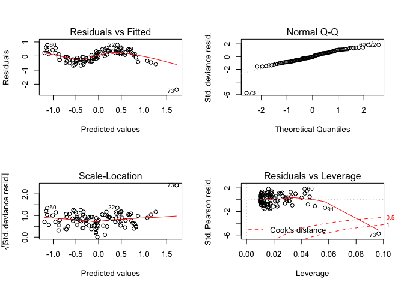
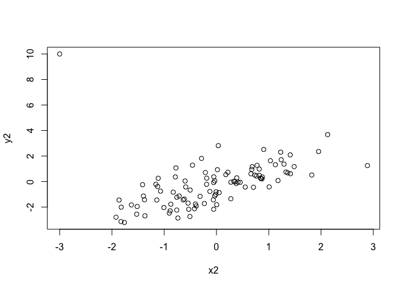
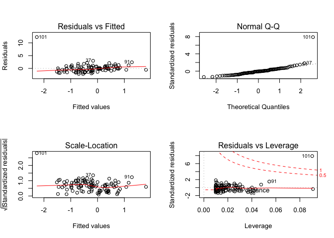
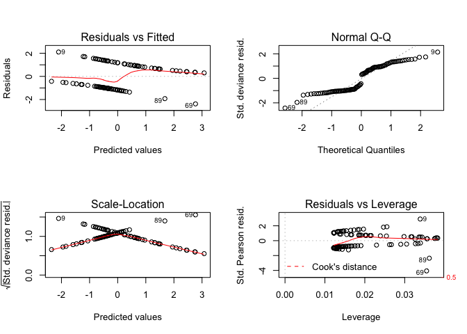

GLM diagnostics
================
Patrick Barks
2019-02-01

Standard glm assumptions are linearity, homogeneity of variance (variance is constant with respect to the explantory variables), and independence of residuals (independence with respect to *any* other variable... measured or not!).

### Diagnostics for a Gaussian glm

``` r
# generate data
x <- rnorm(100)
g <- sample(letters[1:4], 100, replace = TRUE)
y <- -0.2 + 1.1 * x + rnorm(length(x))

# visualize relationship between x and y (check for linearity)
plot(y ~ x)
```



``` r
# fit gaussian glm model
mod <- glm(y ~ x)

# standard diagnostic plots
par(mfrow = c(2, 2))
plot(mod)
```



The diagnostics plots above all look good. We knew this would be the case ahead of time, because the data were generated from the very model that we're fitting!

### Generate data with intentional violation of independence

Note the pattern in residuals (also a violation of the linearity assumption).

``` r
y <- sin(x*1.4) + rnorm(length(x), sd = 0.2)
plot(y ~ x)
```



``` r
# fit model
mod <- glm(y ~ x)

# diagnostics plots
par(mfrow = c(2, 2))
plot(mod)
```



### Generate data with outlier and high leverage

``` r
y <- -0.2 + 1.1 * x + rnorm(length(x))
x2 <- c(x, -3)
y2 <- c(y, 10)
plot(y2 ~ x2)
```



``` r
# fit model
mod2 <- lm(y2 ~ x2)

# diagnostic plots
par(mfrow = c(2, 2))
plot(mod2)
```



### Diagnostics for logistic regression

``` r
library(ggplot2)

logit_inv <- function(a) exp(a) / (exp(a) + 1)

x <- rnorm(100)
y <- rbinom(100, 1, prob = logit_inv(-0.2 + 1.1 * x))

# fit model
mod <- glm(y ~ x, family = "binomial")

# diagnostic plots
par(mfrow = c(2, 2))
plot(mod)
```



Note that the normal-qq plot is no longer relevant to us! Our model residuals should now follow a binomial distribution rather than a normal distribution.
