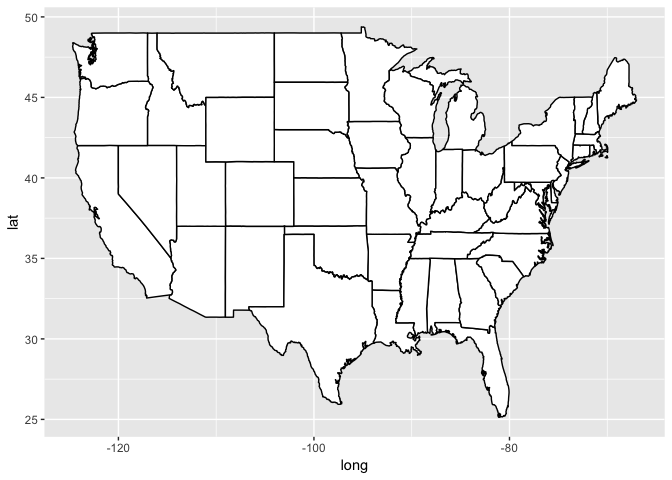
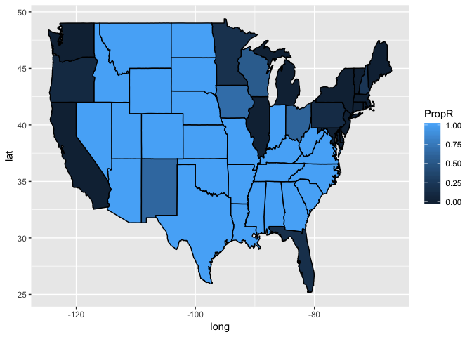
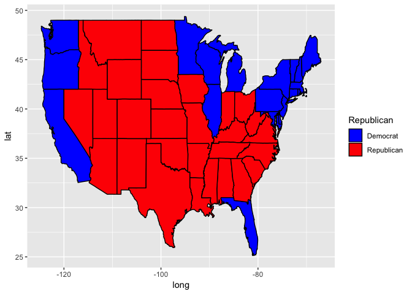
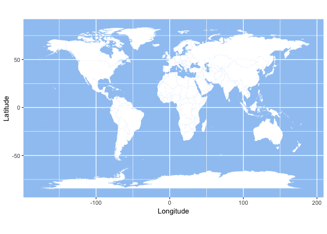

Let's map! How to make a map in R
================
Rita
2019-02-01

### Preliminaries

``` r
library(ggplot2)
library(maps)
library(ggmap)
library(rworldmap)
```

### United States election data

``` r
statesMap = map_data("state")

ggplot(statesMap, aes(x = long, y = lat, group = group)) + 
  geom_polygon(fill = "white", color = "black")
```



``` r
polling <- read.csv("data/PollingImputed.csv")

polling$region = tolower(polling$State)

predictionMap = merge(statesMap, polling, by = "region")

predictionMap <- predictionMap[order(predictionMap$region,
                                     predictionMap$group,
                                     predictionMap$order),]

ggplot(predictionMap, aes(x = long, y = lat, group = group, fill = PropR))+
  geom_polygon(color = "black")
```



``` r
ggplot(predictionMap, aes(x = long, y = lat, group = group, fill = Republican))+
  geom_polygon(color = "black")+
  scale_fill_gradient(low = "blue", high = "red", breaks = c(0,1), guide = "legend",
                      labels = c("Democrat", "Republican"))
```



### World map — locations

``` r
# dat <- read.csv("data/InstitutionsMap.csv")

world.map <- map_data("world")

ggplot() +
  geom_polygon(data = world.map, fill= "white", aes(x=long, y = lat, group = group)) +
  coord_fixed(1.3) +
  geom_tile() +
  labs( x = "Longitude", y = "Latitude") +
  # geom_point(data = dat, aes(x = Long, y = Lat, colour=IUCNstatus))+
  scale_color_brewer()+
  theme(panel.background = element_rect(fill = "#9EC7F3",
                                    colour = "#9EC7F3",
                                    size = 0.5, linetype = "solid"))
```



``` r
# dat$IUCNstatus[dat$IUCNstatus=="LR/cd"]<-"NT"
# dat$IUCNstatus[dat$IUCNstatus=="LR/nt"]<-"NT"
# dat$IUCNstatus[dat$IUCNstatus=="LR/lc"]<-"LC"
# 
# dat$IUCNnew[dat$IUCNstatus=="DD"]<-"1"
# dat$IUCNnew[dat$IUCNstatus=="LC"]<-"2"
# dat$IUCNnew[dat$IUCNstatus=="NT"]<-"3"
# dat$IUCNnew[dat$IUCNstatus=="VU"]<-"4"
# dat$IUCNnew[dat$IUCNstatus=="EN"]<-"5"
# dat$IUCNnew[dat$IUCNstatus=="CR"]<-"6"
# dat$IUCNnew[dat$IUCNstatus=="EW"]<-"7"
# dat$IUCNnew[dat$IUCNstatus=="EX"]<-"8"
# dat$IUCNnew[is.na(dat$IUCNstatus)]<-"0"
# 
# dat <- aggregate (IUCNnew ~ Lat + Long, data=dat, FUN=max)
# 
# dat$IUCN[dat$IUCN=="1"]<-"DD"
# dat$IUCN[dat$IUCN=="2"]<-"LC"
# dat$IUCN[dat$IUCN=="3"]<-"NT"
# dat$IUCN[dat$IUCN=="4"]<-"VU"
# dat$IUCN[dat$IUCN=="5"]<-"EN"
# dat$IUCN[dat$IUCN=="6"]<-"CR"
# dat$IUCN[dat$IUCN=="7"]<-"EW"
# dat$IUCN[dat$IUCN=="8"]<-"EX"
# dat$IUCN[dat$IUCN=="0"]<-"NA"
# 
# dat$IUCN<-factor(dat$IUCN,levels=c("NA","LC","NT","DD","VU","EN","CR","EW","EX"))
# cores<-
#   c("CR"="#d81e05ff",
#     "DD"="#d1d1c6ff",
#     "EN"="#fc7f3fff",
#     "LC"="#60c659ff",
#     "NT"="#cce226ff",
#     "VU"="#f9e814ff",
#     "EW"="#4d192cff",
#     "EX"="#17202A",
#     "NA"="#525252")

ggplot() +
  geom_polygon(data = world.map, fill= "white", aes(x=long, y = lat, group = group)) +
  coord_fixed(1.3) +
  geom_tile() +
  labs( x = "Longitude", y = "Latitude") +
  # geom_point(data = dat, aes(x = Long, y = Lat, colour=IUCN))+
  # scale_color_manual(values=cores)+
  theme(
    panel.background = element_rect(fill = "#9EC7F3",
                                    colour = "#9EC7F3",
                                    size = 0.5, linetype = "solid"),
    panel.grid.major = element_line(size = 0.5, linetype = 'solid',
                                    colour = "white"),
    panel.grid.minor = element_line(size = 0.25, linetype = 'solid',
                                    colour = "white")
  )
```


### Map of Portugal

``` r
library(maptools)
library(Formula)
library(grid)
library(lattice)
library(Hmisc)

ptMapcsv <- read.csv("data/PRT_adm_shp/PRT_adm1.csv")

ptMap <- readShapePoly(fn="PRT_adm1")

pt_distritos <- function(district_data, breaks, palette = "hot", 
                         show_label=TRUE, 
                         # the next args define how to handle non-available datapoints
                         show.NA=FALSE, val.NA=-1, col.NA="black", label.NA="NA") {
  
  # read shapefile file for districts
  library(maptools)
  ptMap <- readShapePoly(fn="PRT_adm1")
  
  init <- ifelse(show.NA,val.NA,min(municipe_data[,2]))
  
  df <- data.frame(districts = ptMap$NAME_1,
                   value     = rep(init,length(ptMap$NAME_1)))
  
  # populate df with district_data (the districts might be in different sorting order)
  for(i in 1:nrow(df)) {
    query <- as.character(district_data[,1])==as.character(df[i,1])
    if (any(query))
      df[i,2] = district_data[which(query),2]
  }
  
  if (any(df==-1))
    breaks = c(0,breaks)
  
  library(Hmisc)
  lev <- cut2(df$value, cuts=breaks)
  n.cols <- length(breaks)+1
  
  if(show_label && length(breaks)>3) { # does not work with small number of breaks (?)
    label_names <- levels(lev)
    if (show.NA && any(df==-1))
      label_names[1] <- "NA"
  } else
    label_names <- ""
  
  if (palette=="hot") {
    cols <- heat.colors(n.cols)
    if (show.NA && any(df==-1))
      cols <- c(col.NA,cols)
  }
  else if (palette == "blue")
    cols <- c("#ece7f2","#9ecae1", "#74a9cf", "#4eb3d3", "#023858", "#081d58")
  else if (palette == "rainbow") {
    cols <- terrain.colors(n.cols)
    if (show.NA && any(df==-1))
      cols <- c(col.NA,cols)
  }
  
  ptMap$value <- as.factor( as.character(as.numeric(lev)) )
  
  library(sp)
  spplot(ptMap, "value", col.regions=cols, 
         xlim = range(-10,-6), ylim = range(36.9,42.2), asp = 1.0,
         colorkey = list(labels = list(labels = label_names, width = 1, cex = 1),
                         space = "bottom"))
}

regiao.quant <- read.csv("~/Desktop/R club/regiao.quant.csv")
district_data <- data.frame(district = ptMap$NAME_1, 
                            value    = regiao.quant$V2) # make some fake data

pt_distritos(district_data, breaks=c(5,10,20,50,150), palette="blue", show.NA=TRUE)

plot(ptMap)
```
