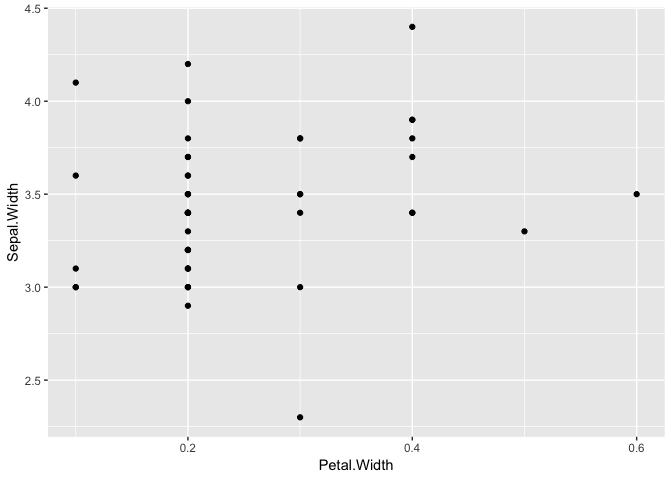
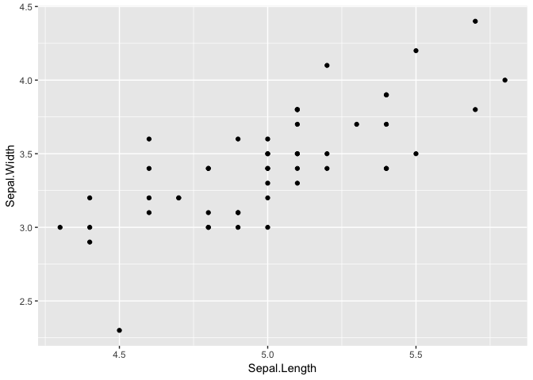
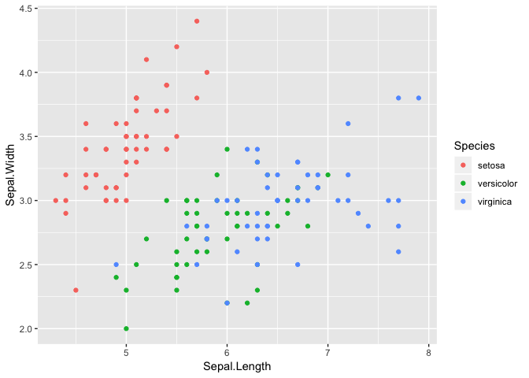
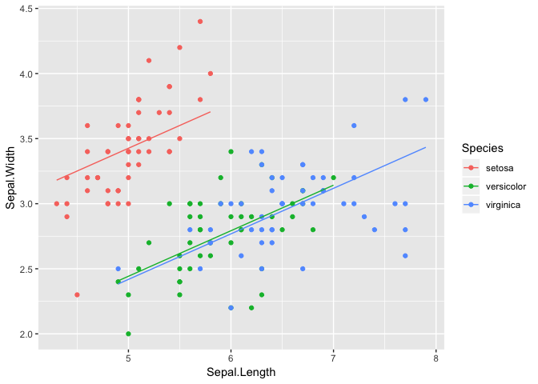
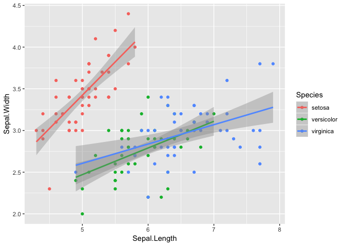
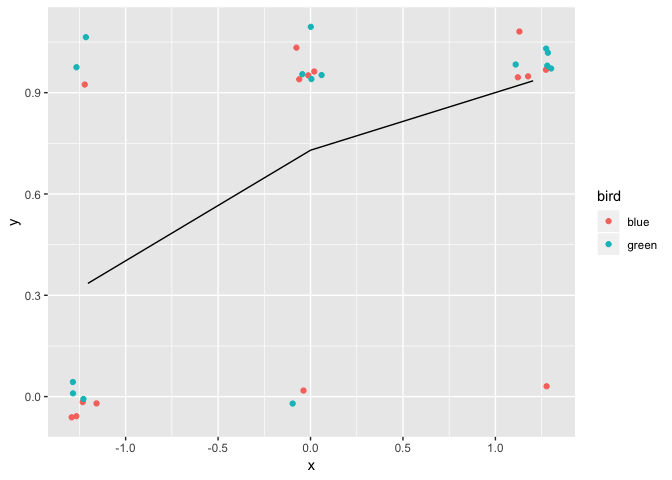
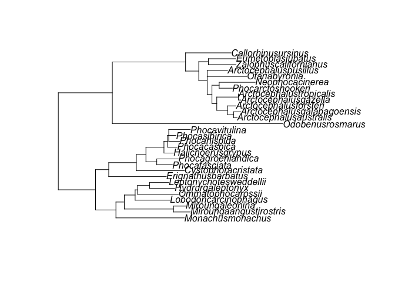
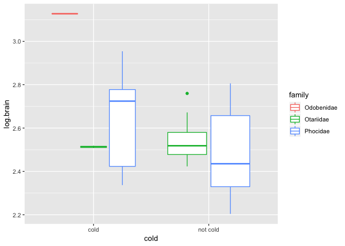

Model(comparison)
================
Simeon
2019-02-01

Normal glm.

``` r
library(ggplot2)

dat = subset(iris, Species == "setosa")

str(dat)
```

    ## 'data.frame':    50 obs. of  5 variables:
    ##  $ Sepal.Length: num  5.1 4.9 4.7 4.6 5 5.4 4.6 5 4.4 4.9 ...
    ##  $ Sepal.Width : num  3.5 3 3.2 3.1 3.6 3.9 3.4 3.4 2.9 3.1 ...
    ##  $ Petal.Length: num  1.4 1.4 1.3 1.5 1.4 1.7 1.4 1.5 1.4 1.5 ...
    ##  $ Petal.Width : num  0.2 0.2 0.2 0.2 0.2 0.4 0.3 0.2 0.2 0.1 ...
    ##  $ Species     : Factor w/ 3 levels "setosa","versicolor",..: 1 1 1 1 1 1 1 1 1 1 ...

``` r
ggplot(dat) +
  geom_point(aes(Petal.Width, Sepal.Width))
```



``` r
model1 = glm(Sepal.Width ~ Petal.Width, data = dat)

summary(model1)
```

    ## 
    ## Call:
    ## glm(formula = Sepal.Width ~ Petal.Width, data = dat)
    ## 
    ## Deviance Residuals: 
    ##      Min        1Q    Median        3Q       Max  
    ## -1.17321  -0.21972   0.01051   0.23493   0.84307  
    ## 
    ## Coefficients:
    ##             Estimate Std. Error t value Pr(>|t|)    
    ## (Intercept)   3.2221     0.1349  23.882   <2e-16 ***
    ## Petal.Width   0.8372     0.5049   1.658    0.104    
    ## ---
    ## Signif. codes:  0 '***' 0.001 '**' 0.01 '*' 0.05 '.' 0.1 ' ' 1
    ## 
    ## (Dispersion parameter for gaussian family taken to be 0.138737)
    ## 
    ##     Null deviance: 7.0408  on 49  degrees of freedom
    ## Residual deviance: 6.6594  on 48  degrees of freedom
    ## AIC: 47.094
    ## 
    ## Number of Fisher Scoring iterations: 2

``` r
ggplot(dat) +
  geom_point(aes(Sepal.Length, Sepal.Width))
```



``` r
model2 = glm(Sepal.Width ~ Sepal.Length, data = dat)

summary(model2)
```

    ## 
    ## Call:
    ## glm(formula = Sepal.Width ~ Sepal.Length, data = dat)
    ## 
    ## Deviance Residuals: 
    ##      Min        1Q    Median        3Q       Max  
    ## -0.72394  -0.18273  -0.00306   0.15738   0.51709  
    ## 
    ## Coefficients:
    ##              Estimate Std. Error t value Pr(>|t|)    
    ## (Intercept)   -0.5694     0.5217  -1.091    0.281    
    ## Sepal.Length   0.7985     0.1040   7.681 6.71e-10 ***
    ## ---
    ## Signif. codes:  0 '***' 0.001 '**' 0.01 '*' 0.05 '.' 0.1 ' ' 1
    ## 
    ## (Dispersion parameter for gaussian family taken to be 0.06580573)
    ## 
    ##     Null deviance: 7.0408  on 49  degrees of freedom
    ## Residual deviance: 3.1587  on 48  degrees of freedom
    ## AIC: 9.8003
    ## 
    ## Number of Fisher Scoring iterations: 2

``` r
model0 = glm(Sepal.Width ~ 1, data = dat)

AIC(model0, model1, model2)
```

    ##        df       AIC
    ## model0  2 47.878793
    ## model1  3 47.093987
    ## model2  3  9.800332

Additive and interactive

``` r
ggplot(iris) + 
  geom_point(aes(Sepal.Length, Sepal.Width, colour = Species))
```



``` r
model = glm(Sepal.Width ~ Sepal.Length, data = iris)

summary(model)
```

    ## 
    ## Call:
    ## glm(formula = Sepal.Width ~ Sepal.Length, data = iris)
    ## 
    ## Deviance Residuals: 
    ##     Min       1Q   Median       3Q      Max  
    ## -1.1095  -0.2454  -0.0167   0.2763   1.3338  
    ## 
    ## Coefficients:
    ##              Estimate Std. Error t value Pr(>|t|)    
    ## (Intercept)   3.41895    0.25356   13.48   <2e-16 ***
    ## Sepal.Length -0.06188    0.04297   -1.44    0.152    
    ## ---
    ## Signif. codes:  0 '***' 0.001 '**' 0.01 '*' 0.05 '.' 0.1 ' ' 1
    ## 
    ## (Dispersion parameter for gaussian family taken to be 0.1886193)
    ## 
    ##     Null deviance: 28.307  on 149  degrees of freedom
    ## Residual deviance: 27.916  on 148  degrees of freedom
    ## AIC: 179.46
    ## 
    ## Number of Fisher Scoring iterations: 2

``` r
model.additive = glm(Sepal.Width ~ Sepal.Length + Species, data = iris)

summary(model.additive)
```

    ## 
    ## Call:
    ## glm(formula = Sepal.Width ~ Sepal.Length + Species, data = iris)
    ## 
    ## Deviance Residuals: 
    ##      Min        1Q    Median        3Q       Max  
    ## -0.95096  -0.16522   0.00171   0.18416   0.72918  
    ## 
    ## Coefficients:
    ##                   Estimate Std. Error t value Pr(>|t|)    
    ## (Intercept)        1.67650    0.23536   7.123 4.46e-11 ***
    ## Sepal.Length       0.34988    0.04630   7.557 4.19e-12 ***
    ## Speciesversicolor -0.98339    0.07207 -13.644  < 2e-16 ***
    ## Speciesvirginica  -1.00751    0.09331 -10.798  < 2e-16 ***
    ## ---
    ## Signif. codes:  0 '***' 0.001 '**' 0.01 '*' 0.05 '.' 0.1 ' ' 1
    ## 
    ## (Dispersion parameter for gaussian family taken to be 0.08351462)
    ## 
    ##     Null deviance: 28.307  on 149  degrees of freedom
    ## Residual deviance: 12.193  on 146  degrees of freedom
    ## AIC: 59.217
    ## 
    ## Number of Fisher Scoring iterations: 2

``` r
ggplot(iris) + 
  geom_point(aes(Sepal.Length, Sepal.Width, colour = Species)) + 
  geom_line(aes(Sepal.Length, model.additive$fitted.values, colour = Species))
```



``` r
model.interactive = glm(Sepal.Width ~ Sepal.Length * Species, data = iris)

ggplot(iris) + 
  geom_point(aes(Sepal.Length, Sepal.Width, colour = Species)) + 
  geom_smooth(aes(Sepal.Length, Sepal.Width, colour = Species), method = glm)
```



``` r
summary(model.interactive)
```

    ## 
    ## Call:
    ## glm(formula = Sepal.Width ~ Sepal.Length * Species, data = iris)
    ## 
    ## Deviance Residuals: 
    ##      Min        1Q    Median        3Q       Max  
    ## -0.72394  -0.16327  -0.00289   0.16457   0.60954  
    ## 
    ## Coefficients:
    ##                                Estimate Std. Error t value Pr(>|t|)    
    ## (Intercept)                     -0.5694     0.5539  -1.028 0.305622    
    ## Sepal.Length                     0.7985     0.1104   7.235 2.55e-11 ***
    ## Speciesversicolor                1.4416     0.7130   2.022 0.045056 *  
    ## Speciesvirginica                 2.0157     0.6861   2.938 0.003848 ** 
    ## Sepal.Length:Speciesversicolor  -0.4788     0.1337  -3.582 0.000465 ***
    ## Sepal.Length:Speciesvirginica   -0.5666     0.1262  -4.490 1.45e-05 ***
    ## ---
    ## Signif. codes:  0 '***' 0.001 '**' 0.01 '*' 0.05 '.' 0.1 ' ' 1
    ## 
    ## (Dispersion parameter for gaussian family taken to be 0.07416645)
    ## 
    ##     Null deviance: 28.307  on 149  degrees of freedom
    ## Residual deviance: 10.680  on 144  degrees of freedom
    ## AIC: 43.342
    ## 
    ## Number of Fisher Scoring iterations: 2

``` r
AIC(model, model.additive, model.interactive)
```

    ##                   df       AIC
    ## model              3 179.46442
    ## model.additive     5  59.21722
    ## model.interactive  7  43.34175

General linear mixed-effect model.

``` r
library(lme4)

x = rep( rep(c(100, 110, 120), each = 5), 2)
x = scale(x)
y = rep(c(0,0,0,0,1,  0,1,1,1,1,  0,1,1,1,1,
                     0,0,0,1,1,  0,1,1,1,1,  1,1,1,1,1))
bird = rep(c("blue", "green"), each = 15)

model = glmer(y ~ x + (1|bird), family = "binomial")

summary(model)
```

    ## Generalized linear mixed model fit by maximum likelihood (Laplace
    ##   Approximation) [glmerMod]
    ##  Family: binomial  ( logit )
    ## Formula: y ~ x + (1 | bird)
    ## 
    ##      AIC      BIC   logLik deviance df.resid 
    ##     35.2     39.4    -14.6     29.2       27 
    ## 
    ## Scaled residuals: 
    ##     Min      1Q  Median      3Q     Max 
    ## -3.7993 -0.7101  0.2632  0.6088  1.4083 
    ## 
    ## Random effects:
    ##  Groups Name        Variance Std.Dev.
    ##  bird   (Intercept) 0        0       
    ## Number of obs: 30, groups:  bird, 2
    ## 
    ## Fixed effects:
    ##             Estimate Std. Error z value Pr(>|z|)  
    ## (Intercept)   0.9925     0.5078   1.955   0.0506 .
    ## x             1.3928     0.5492   2.536   0.0112 *
    ## ---
    ## Signif. codes:  0 '***' 0.001 '**' 0.01 '*' 0.05 '.' 0.1 ' ' 1
    ## 
    ## Correlation of Fixed Effects:
    ##   (Intr)
    ## x 0.440 
    ## convergence code: 0
    ## singular fit

``` r
data = data.frame(x = x, y = y, bird = bird, fit = fitted(model))

ggplot(data) + 
  geom_point(aes(x = x, y = y, colour = bird), 
                          position = position_jitter(w = 0.11, h = 0.1)) +
  geom_line(aes(x, fit))
```



``` r
library(ape)
library(nlme)
library(phytools)
library(rgbif)
library(parallel)
library(ggplot2)
library(MASS)
library(gridExtra)

dat = read.csv2("data/Brains.csv") 
dat = dat[dat$sex == "f",]
dat$log.body.weight = log10(dat$body.weight)
dat$log.brain.size = log10(dat$brain.size)

mytree = read.tree("data/Phylo_pinnipeds.txt")
plot(mytree)
```



``` r
mytree = multi2di(mytree)

phyl = data.frame(species = mytree$tip.label)
row.names(phyl) = mytree$tip.label
for(i in mytree$tip.label){
  phyl$log.brain[phyl$species == i] = median(dat$log.brain.size[dat$species == i])
  phyl$log.body[phyl$species == i] = median(dat$log.body.weight[dat$species == i])
  phyl$brain[phyl$species == i] = median(dat$brain.size[dat$species == i])
  phyl$body[phyl$species == i] = median(dat$body.weight[dat$species == i])
  
  if(as.vector(dat$family[dat$species == i])[1] == "Phocidae")
  {phyl$col[phyl$species == i] = 'dodgerblue3'
  phyl$family[phyl$species == i] = "Phocidae"} 
  if(as.vector(dat$family[dat$species == i])[1] == "Otariidae")
  {phyl$col[phyl$species == i] = 'aquamarine4'
  phyl$family[phyl$species == i] = "Otariidae"}
  if(as.vector(dat$family[dat$species == i])[1] == "Odobenidae ")
  {phyl$col[phyl$species == i] = 'Brown'
  phyl$family[phyl$species == i] = "Odobenidae"}
}

f = function(i) { 
  if (any(unlist(strsplit(toString(i),", ")) %in%
          c("arctic","subarctic","antarctic","subantarctic"))) {
    "cold"
  } else {
    "not cold"
  }
}

dat$cold = sapply(dat$occurrence, f)
phyl$cold = as.factor(
  sapply(phyl$species, function(x) dat$cold[dat$species == as.character(x)][1])
)

ggplot(phyl) +
  geom_boxplot(aes(cold, log.brain, colour = family))
```



``` r
m.null = gls(log.brain ~ 1, data = phyl, correlation = corBrownian(1, mytree))
m.body = gls(log.brain ~ log.body, data = phyl, correlation = corBrownian(1, mytree))
m.col.a = gls(log.brain ~ cold + log.body, data = phyl, correlation = corBrownian(1, mytree))
m.col.i = gls(log.brain ~ cold * log.body, data = phyl, correlation = corBrownian(1, mytree))

AIC(m.null, m.body, m.col.a, m.col.i)
```

    ## Warning in AIC.default(m.null, m.body, m.col.a, m.col.i): models are not
    ## all fitted to the same number of observations

    ##         df       AIC
    ## m.null   2 -35.12056
    ## m.body   3 -45.04063
    ## m.col.a  4 -45.81561
    ## m.col.i  5 -41.49660

``` r
summary(m.col.i)
```

    ## Generalized least squares fit by REML
    ##   Model: log.brain ~ cold * log.body 
    ##   Data: phyl 
    ##        AIC       BIC  logLik
    ##   -41.4966 -35.40222 25.7483
    ## 
    ## Correlation Structure: corBrownian
    ##  Formula: ~1 
    ##  Parameter estimate(s):
    ## numeric(0)
    ## 
    ## Coefficients:
    ##                            Value  Std.Error   t-value p-value
    ## (Intercept)            1.9905587 0.18164037 10.958790  0.0000
    ## coldnot cold           0.0680444 0.14759037  0.461035  0.6488
    ## log.body               0.3343929 0.07192018  4.649500  0.0001
    ## coldnot cold:log.body -0.0754750 0.07009344 -1.076777  0.2919
    ## 
    ##  Correlation: 
    ##                       (Intr) cldntc lg.bdy
    ## coldnot cold          -0.612              
    ## log.body              -0.900  0.672       
    ## coldnot cold:log.body  0.626 -0.980 -0.701
    ## 
    ## Standardized residuals:
    ##         Min          Q1         Med          Q3         Max 
    ## -1.97762345 -0.93478857 -0.21326049 -0.03433875  1.06216042 
    ## 
    ## Residual standard error: 0.1542731 
    ## Degrees of freedom: 29 total; 25 residual
