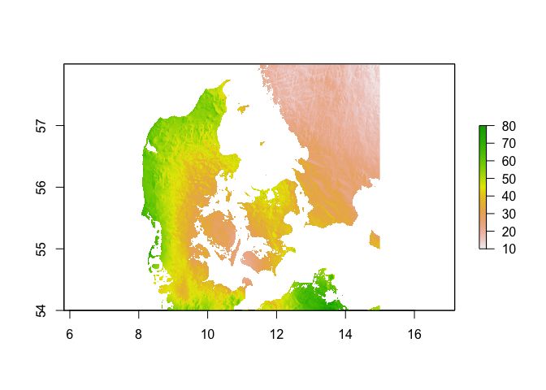
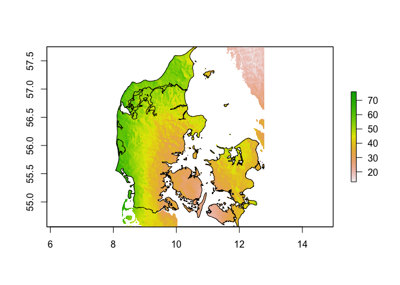
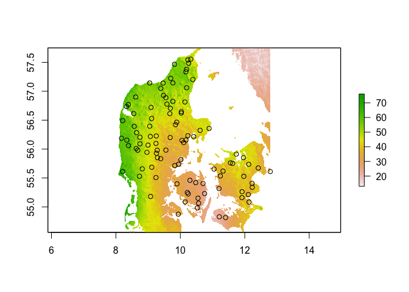
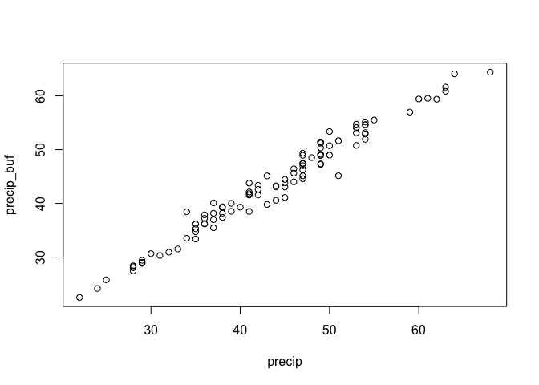
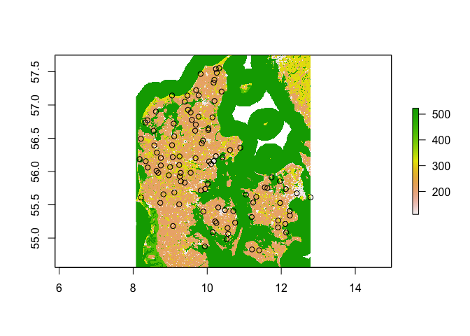
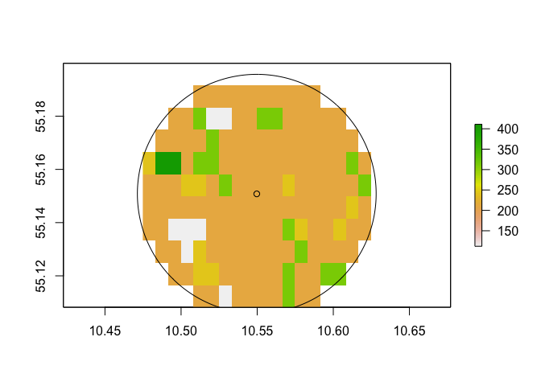
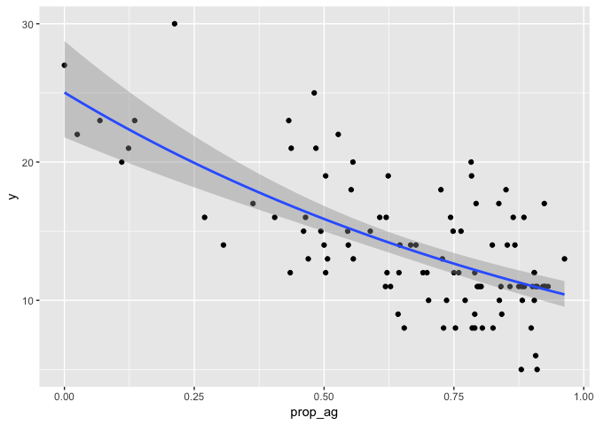

Working with rasters
================
Patrick Barks
2019-02-11

Preliminaries
-------------

``` r
library(raster)
library(rgdal)
library(rgeos)
library(ggplot2)
```

Load Chelsa precipitation raster
--------------------------------

From [http://chelsa-climate.org/](). This particular file gives global monthly precipitation (mm) in September 2003, at a resolution of ~1 sq-km.

``` r
chelsa <- raster("shp/CHELSA_prec_2003_09_V1.2.1.tif")

# plot region around Denmark
plot(chelsa, xlim = c(8, 15), ylim = c(54, 58))
```



Derive shapefile for 'contiguous' Denmark
-----------------------------------------

``` r
# read Europe shapefile
# from https://ec.europa.eu/eurostat/web/gisco/geodata/reference-data
euro <- readOGR(dsn = "shp/NUTS_RG_01M_2016_4326_LEVL_1",
                layer = "NUTS_RG_01M_2016_4326_LEVL_1")
```

    ## OGR data source with driver: ESRI Shapefile 
    ## Source: "/Users/patrickbarks/r-club/2019-03/shp/NUTS_RG_01M_2016_4326_LEVL_1", layer: "NUTS_RG_01M_2016_4326_LEVL_1"
    ## with 125 features
    ## It has 5 fields

``` r
# subset to Denmark
dk <- subset(euro, NUTS_NAME == "DANMARK")

# manually ditch Bornholm
dk_crop <- extent(dk)
dk_crop@xmax <- 12.9
dk <- crop(dk, dk_crop)
```

Crop Chelsa raster to extent of Denmark
---------------------------------------

``` r
chelsa_dk <- crop(chelsa, dk)

# plot
plot(chelsa_dk)
lines(dk)
```



Load site-specific data, and convert to spatial object
------------------------------------------------------

``` r
sites <- read.csv("shp/site_data.csv")

coordinates(sites) <- c("lon", "lat")
proj4string(sites) <- proj4string(dk)

# plot sites over climate raster
plot(chelsa_dk)
points(sites)
```



Get precipitation value for each site
=====================================

``` r
# extract precipitation from single raster cell for each site
sites$precip <- extract(chelsa_dk, sites)

# or, average precipitation using 4km buffer
precip_buffer <- extract(chelsa_dk, sites, buffer = 4000)
sites$precip_buf <- sapply(precip_buffer, mean, na.rm = TRUE)

# compare raw precip to precip_buffer
plot(precip_buf ~ precip, sites)
```



### Load European land use raster

From [https://land.copernicus.eu/pan-european/corine-land-cover/clc-2012]().

``` r
corine <- raster("shp/corine/CLC2018_CLC2012_V2018_20b2.tif")

# re-project corine to lat/lon, and crop to dk
corine_dk <- projectRaster(corine, chelsa_dk, method = "ngb")

# plot 
plot(corine_dk)
points(sites)
```



Examine most common land-use types
----------------------------------

``` r
# legend at https://land.copernicus.eu/pan-european/corine-land-cover/clc-2012
sort(table(getValues(corine_dk)))
```

    ## 
    ##   334   511   132   133   332   122   522   333   222   123   131   111 
    ##     1     9    12    20    27    33    57    58    76   117   124   142 
    ##   124   331   141   412   321   411   421   121   521   322   512   142 
    ##   171   247   302   536   563   628   733   948  1150  1161  1234  1512 
    ##   242   423   311   324   313   231   112   312   243   211   523 
    ##  2068  2493  2701  2932  3215  3363  5296  7456  7576 60697 95661

Examine proportion agriculture around a specific site
-----------------------------------------------------

``` r
i <- sample(1:nrow(sites), 1)
site_i <- sites[i,]
buffer_i <- buffer(site_i, 5000)
corine_crop_i <- crop(corine_dk, buffer_i)
corine_mask_i <- mask(corine_crop_i, buffer_i)

plot(corine_mask_i)
points(site_i)
lines(buffer_i)
```



``` r
x <- extract(corine_mask_i, site_i, buffer = 5000)[[1]]
length(x[x >= 211 & x <= 243]) / length(x)  # proportion agriculture
```

    ## [1] 0.8421053

Relationship between y and prop\_ag
-----------------------------------

``` r
# agricultural land includes categories 211-243
proportion_ag <- function(x) length(x[x >= 211 & x <= 243]) / length(x)

# calculate proportion ag around each site using 5km buffer
land_buffer <- extract(corine_dk, sites, buffer = 5000)
sites$prop_ag <- sapply(land_buffer, proportion_ag)

# plot
ggplot(sites@data, aes(prop_ag, y)) +
  geom_point() +
  geom_smooth(method = "glm", method.args = list(family = "poisson"))
```


