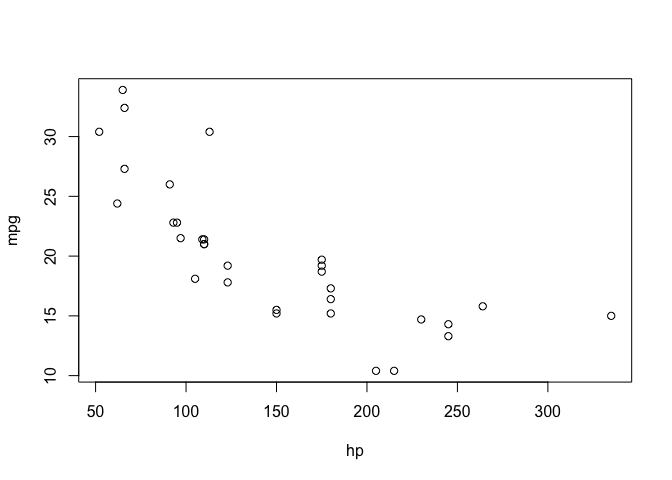

My presentation title
================
My Name
YYYY-MM-DD

This is an R Markdown document formatted for GitHub. When you click the **Knit** button in RStudio, the contents of this document will be 'knitted' into a markdown file (.md), including all the code chunks within the document and their output. Check out the markdown file corresponding to this document, "template.md".

On GitHub, the markdown file will be rendered into an HTML document, formatted according to [GitHub's markdown rules](https://guides.github.com/features/mastering-markdown/).

This is a header
----------------

#### And here's a smaller header

Regular paragraph text can be written directly in the document, like this.

Including code
--------------

You can include R code in the document as follows:

``` r
head(mtcars)
```

    ##                    mpg cyl disp  hp drat    wt  qsec vs am gear carb
    ## Mazda RX4         21.0   6  160 110 3.90 2.620 16.46  0  1    4    4
    ## Mazda RX4 Wag     21.0   6  160 110 3.90 2.875 17.02  0  1    4    4
    ## Datsun 710        22.8   4  108  93 3.85 2.320 18.61  1  1    4    1
    ## Hornet 4 Drive    21.4   6  258 110 3.08 3.215 19.44  1  0    3    1
    ## Hornet Sportabout 18.7   8  360 175 3.15 3.440 17.02  0  0    3    2
    ## Valiant           18.1   6  225 105 2.76 3.460 20.22  1  0    3    1

Including figures
-----------------

You can embed plots generated from R scripts like this:

``` r
plot(mpg ~ hp, data = mtcars)
```



Or, embed an external figure like this:


Including links
---------------

Here's a link to an [R Markdown guide](https://rmarkdown.rstudio.com/lesson-2.html) by RStudio.
